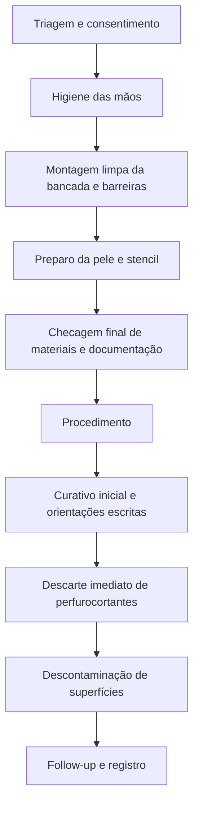
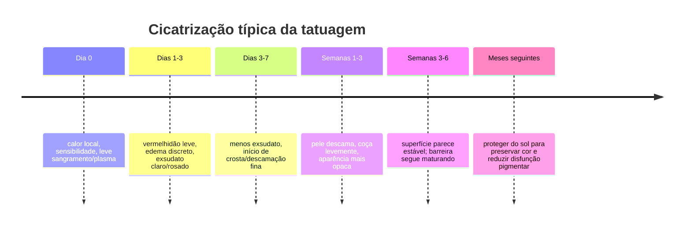

# Manual prático de cuidados com tatuagem para iniciantes e clientes

## Resumo executivo

Este manual reúne práticas essenciais para **antes**, **durante** e **depois** da tatuagem com foco em dois públicos: quem está começando a tatuar e quem vai receber a tatuagem. O eixo central é simples: a tatuagem é um procedimento artístico que também cria uma **ferida aguda** e envolve **exposição a sangue e fluidos**; por isso, o padrão mínimo aceitável combina triagem honesta, higiene de mãos, barreiras, descarte imediato de perfurocortantes, decontaminação de superfícies, tinta com documentação técnica e acompanhamento pós-procedimento com instruções escritas. OSHA, CDC, WHO, EADV, FDA e autoridades europeias convergem nesse ponto, ainda que as regras detalhadas variem por país/estado/município. citeturn15view6turn32view0turn40view1turn28view0turn15view4turn15view5

Para iniciantes, a melhor decisão técnica costuma ser **reduzir variáveis**: trabalhar com poucos tipos de agulha, uma máquina estável com **stroke médio**, tensões iniciais conservadoras, designs simples, contrastes claros, poucas passadas e pele bem esticada. Em geral, um stroke de **3,5 mm** é o “meio-termo” mais versátil para aprender, enquanto tensões iniciais de aproximadamente **7,5–9 V para linha**, **6–8 V para sombra** e **7–9 V para packing** funcionam como ponto de partida, não como regra fixa; a regulagem correta depende de máquina, stroke, hang, agrupamento, velocidade da mão e resposta da pele. citeturn38view2turn38view0turn39view0

Também é prudente separar o que é **bom para treino** do que é **bom para primeiros clientes**. Para pele humana no começo, estilos com leitura simples e margem técnica mais previsível — como **traditional simples**, **blackwork básico** e pequenos trabalhos em **preto e cinza** — costumam ser mais seguros. Já **cover-up**, **micro fine line muito delicado**, **grandes áreas de cor sólida**, **realismo em retrato** e projetos extensos em regiões anatômicas difíceis exigem uma consistência técnica que ainda está sendo construída. citeturn20search1turn20search2turn21search1turn21search0turn39view0

Por fim, o risco mais subestimado não é “errar o desenho”; é **deixar a biossegurança cair**. Tatuadores iniciantes devem tratar a organização do posto, a troca correta de luvas, a higienização das mãos, o descarte imediato de agulhas e o registro de materiais usados como parte do trabalho artístico, não como burocracia paralela. Isso protege o cliente, o profissional e a reputação do estúdio. citeturn32view0turn30view2turn30view3turn31view0

## Princípios de segurança e triagem

A triagem ideal começa **antes do desenho tocar a pele**. O cliente deve preencher e assinar consentimento informado e informar medicações, alergias, reações prévias a tatuagem/adesivos/antissépticos, tendência a queloide e condições que pioram cicatrização ou infecção. Autoridades clínicas e dermatológicas chamam atenção para riscos como alergia, granuloma, queloide e infecção; além disso, para qualquer procedimento que rompe a pele, é prudente adiar a sessão se houver pele lesionada, dermatite ativa, queimadura solar, infecção local ou condição clínica descompensada que mereça avaliação médica prévia. citeturn45search2turn28view0turn12search9turn12search11

O artista iniciante deve trabalhar como se **todo sangue e fluido corporal fosse potencialmente infeccioso**, aplicando precauções universais. A OSHA exige plano escrito de controle de exposição, métodos de conformidade, EPI adequado, descarte e contenção corretos de perfurocortantes, procedimentos de housekeeping, vacinação contra hepatite B para trabalhadores expostos e avaliação pós-exposição; para tatuadores e body piercers, a própria OSHA já esclareceu que a norma se aplica porque o procedimento gera sangue. citeturn15view6turn32view0turn30view0

Higiene das mãos não é opcional e não é “substituída por luvas”. A WHO recomenda fricção alcoólica quando as mãos **não estiverem visivelmente sujas** e lavagem com água e sabão quando houver sujeira visível, sangue ou outros fluidos. A fricção alcoólica dura em torno de **20–30 segundos**; a lavagem, **40–60 segundos**. A WHO também lembra que as mãos devem estar secas antes de calçar luvas, unhas naturais devem ser curtas e o uso de luvas não elimina a necessidade de higiene das mãos. citeturn40view1turn41view0turn41view1

Antes de qualquer sessão, o posto precisa estar organizado como um “campo limpo”: superfícies já descontaminadas, barreiras novas aplicadas, cartucho/agulha estéreis fechados, copinhos, vaselina/unguento de trabalho, papel-toalha, filme, lâmina descartável e recipiente para descarte perfurocortante **ao alcance**. A OSHA exige que superfícies de trabalho sejam descontaminadas com desinfetante apropriado ao fim do procedimento, após derramamento e no fim do turno quando houver risco de contaminação. Para superfícies com risco de sangue, procure desinfetante registrado com ação contra HIV/HBV/HCV e respeite o **tempo de contato do rótulo**; a EPA ressalta que a eficácia muda de acordo com o modo de uso. citeturn15view6turn15view7turn15view2

## Protocolo pré-tatuagem

### Fluxo prático para o artista

**Entre 24 horas e o início da sessão**, confirme desenho, tamanho, local anatômico, consentimento, restrições de idade/documentação exigidas localmente e instruções para o cliente chegar alimentado, descansado e sem pele irritada. Embora a literatura regulatória foque mais em segurança do procedimento do que em “preparo estético”, autoridades clínicas e dermatológicas reforçam que o procedimento deve ocorrer em **pele limpa e saudável**, não sobre área com infecção, queimadura solar ou irritação importante. citeturn28view0turn45search1turn45search2

**No preparo da bancada**, faça higiene de mãos; coloque barreiras em cabos, fonte, borrifadores e áreas de toque; separa materiais de uso único; confira lote/validade das tintas; deixe o coletor de perfurocortantes visível e sem excesso de enchimento. A OSHA exige descarte de perfurocortantes em recipientes fecháveis, resistentes à perfuração, impermeáveis, identificados, mantidos na vertical e substituídos rotineiramente antes de encher demais. citeturn30view3

**Na pele do cliente**, a ordem mais segura para iniciantes é: avaliação visual, tricotomia com lâmina descartável se necessário, limpeza/prep de pele conforme o produto escolhido, secagem adequada e transferência do stencil em pele íntegra. Se usar produtos de preparo ou transferência, só utilize itens com procedência clara, FISPQ/SDS quando disponível e compatibilidade conhecida com a pele. citeturn24search1turn24search2turn15view0turn6search16

### Checklist pré-sessão

- consentimento e ficha de triagem preenchidos; confirmar alergias a adesivos, antissépticos e pós-cuidado citeturn28view0
- área da pele **sem infecção, dermatite ativa ou queimadura solar** citeturn28view0turn45search1turn45search2
- mãos higienizadas corretamente; mãos secas antes das luvas citeturn40view1turn41view1
- bancada descontaminada e reenvelopada; superfícies de toque com barreira citeturn15view6turn15view7
- cartucho/agulha estéreis, integridade da embalagem verificada citeturn37search4turn37search12
- tinta com lote e documentação técnica disponível; diluentes apenas estéreis citeturn43view2turn43view0turn43view1turn5search8
- coletor de perfurocortantes disponível, próximo e não sobrecarregado citeturn30view3
- stencil seco e estável antes de começar a tatuar citeturn11search0turn24search2

### Proposta de fluxograma

O fluxograma abaixo resume um fluxo seguro e enxuto; ele sintetiza os protocolos de OSHA, WHO, EADV e CDC. citeturn15view6turn40view1turn28view0turn42search0

## Protocolo durante a tatuagem

O principal objetivo técnico durante a sessão é **entregar o mínimo de trauma capaz de implantar o pigmento na profundidade certa**. Para o tatuador iniciante, isso significa trabalhar com pele bem esticada, máquina regulada em faixa conservadora, profundidade moderada, número de passadas mínimo e limpeza delicada, sem “esfregar” o stencil para longe. A Tattooing 101 enfatiza que linhas instáveis muitas vezes vêm de vibração, postura ruim ou estiramento inadequado da pele; a FK Irons reforça que blowout e falhas de saturação aparecem quando profundidade, hang, voltagem e velocidade da mão não se conversam. citeturn11search0turn39view0turn38view3

Na prática, **pare imediatamente** para trocar luvas quando tocar em superfície não protegida, quando houver rasgo, ou quando a tarefa mudar de um passo contaminado para outro “limpo”. Depois da retirada das luvas, a OSHA exige lavagem das mãos imediatamente ou tão logo seja possível; a WHO também lembra que a indicação de higiene das mãos existe independentemente do uso de luvas. citeturn42search1turn40view1

Evite improvisos com agulhas. A OSHA foi explícita ao dizer que, no setor de tatuagem, perfurocortantes contaminados de uso único devem ser **descartados imediatamente**; dobrar, quebrar, recapear ou tentar recuperar partes da agulha aumenta o risco de lesão. Para quem está começando, sistemas de cartucho com membrana de segurança ajudam a reduzir refluxo de tinta/fluido para o grip e a máquina, diminuindo risco de contaminação cruzada. citeturn32view0turn30view3turn9search7turn37search0

Também é aqui que a técnica de limpeza importa. Limpe com suavidade, usando papel descartável novo conforme necessário, para não apagar o stencil desnecessariamente. Uma orientação prática muito útil para iniciantes é começar de forma a evitar apoiar a mão sobre partes ainda não tatuadas do desenho; isso reduz borramento do stencil e o impulso de “compensar” passando demais no mesmo lugar. citeturn11search0

### Regulagem base para começar

As faixas abaixo são **pontos de partida**, não presets universais. Ajuste sempre com base na máquina, cartucho, pele e sua velocidade de mão. citeturn38view0turn39view0turn38view3

| Técnica                      | Faixa inicial de voltagem | Stroke geralmente mais útil | Observação prática                                                                                                                              |
| ---------------------------- | ------------------------: | --------------------------: | ----------------------------------------------------------------------------------------------------------------------------------------------- |
| Linha                        |                   7,5–9 V |                  3,5–4,2 mm | buscar linha contínua em uma passada; se “pontilhar”, ou a mão está rápida demais ou a máquina está lenta demais citeturn38view0turn39view0 |
| Sombra suave preto e cinza   |                     6–8 V |                  2,5–3,0 mm | hit mais suave reduz chance de mastigar a pele durante camadas sucessivas citeturn38view0turn39view0                                        |
| Whip shading                 |                ~6,5–8,5 V |                  3,5–4,0 mm | textura mais “peperizada” e controle de saída da sombra citeturn39view0turn11search25                                                       |
| Packing de preto/cor         |                     7–9 V |                     4,0 mm+ | mão um pouco mais lenta, movimento pequeno e consistente para evitar “holidays” citeturn38view0turn39view0                                  |
| Máquina única para iniciante |   ajuste conforme técnica |                      3,5 mm | o 3,5 mm é o compromisso mais versátil para aprender linha, sombra e packing básico citeturn38view2                                          |

### Checklist intra-sessão

- higiene de mãos no início e após cada troca crítica de luvas citeturn40view1turn42search1
- pele sempre esticada; postura com múltiplos pontos de apoio para estabilidade citeturn11search0turn21search24
- profundidade mínima necessária; começar com pouco needle hang e testar em pele sintética citeturn38view3turn19search14
- não usar água de torneira para diluir tinta/gray wash; usar água estéril ou diluente apropriado citeturn5search8turn45search15
- descarte imediato do cartucho/agulha ao fim da sessão; nunca quebrar ou reprocessar uso único citeturn32view0turn30view3
- limpeza de superfícies com desinfetante registrado e tempo de contato correto citeturn15view7turn15view2

## Protocolo pós-tatuagem

O pós-cuidado deve ser explicado **oralmente e por escrito**. A EADV resume bem os princípios: o objetivo é restaurar a barreira cutânea, evitar infecção e favorecer bom aspecto final. Não existe um “gold standard” único para toda tatuagem, mas os princípios básicos de higiene são estáveis: mãos limpas antes de tocar, roupa limpa em contato com a área, banho pode, fricção não pode, não arrancar crostas/descamação, evitar piscina/banheira/sauna até cicatrizar, evitar sol por meses e só usar filtro alto após cicatrização completa. citeturn28view0

Há dois caminhos razoáveis de curativo inicial. Um é o **filme/second skin**: a EADV informa que o filme ou bandagem pode permanecer por **24 horas ou até vários dias** se estiver confortável e sem vazamento; se houver vazamento de exsudato, deve ser trocado. Outro é o caminho “tradicional”: lavagens suaves e aplicação de uma fina camada de emoliente/unguento hipoalergênico **2–3 vezes ao dia por 2–3 dias**, passando depois para emoliente simples. A EADV também é clara ao dizer que **desinfetantes e cremes antibióticos não são necessários de rotina** durante a cicatrização e só devem ser usados se houver infecção e avaliação médica. citeturn28view0

Para lavagem caseira, prefira água corrente morna, pouca quantidade de sabonete suave e secagem com papel-toalha limpo ou ao ar, sem esfregar. Em feridas em geral, a dermatologia desaconselha usar peróxido de hidrogênio, álcool ou iodo na área em cicatrização porque podem ressecar e irritar o tecido. citeturn28view0turn45search7

### Linha do tempo de cicatrização

A linha do tempo abaixo resume o que é **normal** e o que exige vigilância; foi condensada da EADV e de materiais clínicos de infecção/cicatrização. citeturn28view0turn27search4

### Checklist pós-sessão para o cliente

- lave as mãos antes de tocar na tatuagem citeturn28view0turn40view1
- se usar filme, mantenha conforme instrução do tatuador; troque se houver vazamento importante citeturn28view0turn8search9
- lave suavemente e seque sem fricção citeturn28view0
- use camada **fina** de emoliente; excesso de produto dificulta a cicatrização citeturn28view0turn45search0
- não coce, não arranque casquinha, não esfregue a área citeturn28view0
- evite piscina, banheira, sauna e submersão até a cicatrização completa citeturn28view0turn8search13
- evite roupas apertadas e fricção excessiva citeturn28view0turn45search0
- depois de totalmente cicatrizada, proteja do sol com FPS alto citeturn28view0

## Tintas, agulhas e máquina

### Tintas e aditivos

Tinta de tatuagem não é um “corante simples”; ela costuma ser uma **suspensão de pigmentos insolúveis** em um veículo com solventes e estabilizantes. Em revisões técnico-regulatórias, aparecem com frequência água, etanol ou isopropanol, glicerina, ligantes/polímeros, surfactantes, espessantes e conservantes. O problema prático é que nem sempre o rótulo reflete tudo o que está dentro do frasco: um estudo analítico publicado em _Analytical Chemistry_ encontrou **aditivos e/ou pigmentos não listados em 45 de 54 amostras** de tintas do mercado norte-americano, incluindo PEG, propilenoglicol e 2-fenoxietanol; autoridades regulatórias europeias e holandesas também seguem encontrando VOCs, conservantes e metais pesados/impurezas em parte das amostras. citeturn18search7turn18search2turn18search18turn18search6

Do ponto de vista regulatório, a União Europeia restringiu milhares de substâncias em tintas de tatuagem e PMU sob REACH, justamente por preocupações com alergias e potenciais efeitos de longo prazo. Na prática de estúdio, isso significa: **compre só tinta com SDS/FISPQ atual, lote rastreável, listagem de ingredientes/certificados e compatibilidade regulatória com o mercado em que você atua**. citeturn15view5turn43view0turn43view1turn43view2turn43view5

Em termos de pigmento, alguns padrões são muito comuns: **carbon black** em pretos; **dióxido de titânio** em brancos e para opacificar; **óxidos de ferro** em marrons/tons terrosos; **ftalocianina de cobre** em azuis e verdes; e diversos **azo pigments** em amarelos/laranjas/vermelhos. Reações alérgicas continuam sendo relatadas com mais frequência em certas cores — historicamente, o vermelho é um protagonista clássico nas revisões médicas — e impurezas/metais podem vir tanto do pigmento quanto de coformulantes e do processo fabril. citeturn5search18turn18search16turn18search18turn45search2

O cuidado mais prático para o dia a dia é este: **nunca diluir tinta ou preparar gray wash com água de torneira**. O CDC investigou surtos por micobactérias não tuberculosas ligados a tinta contaminada e gray wash feito com torneira; a recomendação inequívoca é usar água estéril. citeturn5search8

### Produtos recomendados para um setup inicial enxuto

A tabela abaixo prioriza produtos de uso recorrente com **fonte oficial** e **documentação técnica** acessível. Onde o fabricante trabalha com portal SDS por cor/lote, isso está indicado. Em alguns curativos/OTC/medical devices, o documento aplicável pode ser IFU/ingredient disclosure além ou no lugar de SDS tradicional. citeturn43view2turn43view0turn44search1

| Categoria                        | Produto exemplo                                | Uso prático                                                                                                                                         | Fonte oficial                     | SDS/FISPQ ou doc técnico                                                                                                             |
| -------------------------------- | ---------------------------------------------- | --------------------------------------------------------------------------------------------------------------------------------------------------- | --------------------------------- | ------------------------------------------------------------------------------------------------------------------------------------ |
| preparo de pele                  | **Hibiclens**                                  | limpeza antisséptica de pele íntegra antes do procedimento; seguir rótulo e evitar áreas não indicadas pelo fabricante citeturn15view0           | citeturn15view0                | citeturn6search0                                                                                                                  |
| limpeza durante a sessão         | **Cosco Tincture of Green Soap**               | solução concentrada clássica para limpeza durante o procedimento; verificar diluição e compatibilidade com a pele citeturn6search16              | citeturn6search16              | citeturn6search20                                                                                                                 |
| desinfecção de superfície        | **CaviCide**                                   | descontaminação de superfícies duras não porosas; respeitar **tempo de contato** do rótulo citeturn15view2turn15view7                           | citeturn15view2                | citeturn7search8                                                                                                                  |
| papel de stencil                 | **Spirit Classic Thermal**                     | transferência de stencil com boa nitidez e estabilidade citeturn23search0                                                                        | citeturn23search0              | fabricante não destacou SDS na página do produto consultada; manter documentação do distribuidor quando exigido citeturn23search0 |
| transferência de stencil         | **Stencil Stuff**                              | loção específica para fixação do stencil citeturn24search5                                                                                       | citeturn24search18             | citeturn24search2                                                                                                                 |
| tinta preta versátil             | **Dynamic Black / Triple Black / Union Black** | linha, sombra e packing conforme formulação; a marca mantém portal SDS próprio citeturn43view3                                                   | citeturn43view3                | citeturn43view2                                                                                                                   |
| tintas REACH/ingredientes        | **World Famous Limitless**                     | linha/packing com portal central de SDS e listagem de ingredientes/certificados citeturn43view0                                                  | citeturn43view0                | citeturn43view0                                                                                                                   |
| tintas com SDS por idioma        | **INTENZE / GEN‑Z**                            | linha de tintas com foco explícito em segurança e SDS por idioma citeturn17search7turn17search11                                                | citeturn17search7              | citeturn43view1                                                                                                                   |
| tinta com MSDS centralizado      | **Solid Ink**                                  | marca com página de info/MSDS e orientação de spot test; evitar uso ocular citeturn43view4                                                       | citeturn43view4                | citeturn43view4                                                                                                                   |
| emoliente/barreira após a sessão | **Aquaphor Healing Ointment**                  | pomada oclusiva leve/skin protectant; usar camada fina e por curto período, conforme orientação do tatuador/pele citeturn44search6turn44search1 | citeturn44search6              | citeturn44search1                                                                                                                 |
| filme de cicatrização            | **Saniderm**                                   | curativo “second skin” com instruções próprias de reaplicação/tempo de uso citeturn8search9turn8search12                                        | citeturn8search1turn8search12 | instruções do fabricante em vez de SDS tradicional consultada aqui citeturn8search12                                              |
| filme médico alternativo         | **3M Tegaderm**                                | filme transparente; não esticar durante a aplicação e aplicar em pele limpa e seca citeturn7search3                                              | citeturn7search3               | IFU/aplicação citeturn7search3                                                                                                    |

### Agulhas, tamanhos, usos, técnicas, vantagens e limites

Os códigos mais úteis para iniciantes são: **RL** (round liner), **RS** (round shader), **FL/FS** (flat), **M1** (magnum weave), **M2** (stacked magnum), **CM/RM/SEM** (curved/soft edge magnum). Fabricantes como Cheyenne e Kwadron trabalham amplamente com diâmetros entre **0,25 e 0,40 mm**; no uso comum, 0,25 mm costuma ser lido como “bugpin”, 0,30 mm como intermediário e 0,35 mm como diâmetro padrão robusto. citeturn9search7turn35view1

| Tipo                          | Códigos comuns          | Melhor uso                                                        | Técnica de aplicação recomendada                                                                                                                                     | Vantagens                                                                                                                                                          | Limites e complicações mais comuns                                                                                                              |
| ----------------------------- | ----------------------- | ----------------------------------------------------------------- | -------------------------------------------------------------------------------------------------------------------------------------------------------------------- | ------------------------------------------------------------------------------------------------------------------------------------------------------------------ | ----------------------------------------------------------------------------------------------------------------------------------------------- |
| **Round Liner**               | 1RL, 3RL, 5RL, 7RL, 9RL | contorno, detalhes, lettering simples                             | pele muito bem esticada, movimento contínuo, uma passada quando possível; excelente para aprender consistência de linha citeturn35view0turn35view4turn11search0 | máximo controle e precisão em linhas pequenas citeturn35view0turn35view4                                                                                       | menos tolerante a excesso de profundidade; blowout e linha tremida aparecem rápido se mão/voltagem/profundidade não combinam citeturn39view0 |
| **Round Shader**              | 3RS, 5RS, 7RS, 9RS      | sombra em áreas pequenas, preenchimento pequeno, cantos apertados | pequenos círculos, pendulum leve, construção gradual de tom; para iniciantes, FK sugere foco em 3, 5, 7 e 9 RS citeturn35view4turn11search25                     | muito versátil para aprendizagem e áreas pequenas citeturn35view4                                                                                               | cobertura lenta em áreas grandes; se a máquina estiver fraca demais, pode deixar sombra lavada/patchy citeturn38view0turn39view0            |
| **Flat**                      | 3FL, 5FL, 7FS           | linhas escuras, geométricos e técnicas específicas de sombra      | usar quando você já consegue manter ângulo e profundidade estáveis; trabalhar com pele bem plana e trajetos previsíveis citeturn35view4turn37search1             | deposita bastante tinta e pode gerar linhas escuras em uma passada citeturn35view4                                                                              | menos “perdoadora” em curvas e áreas muito orgânicas; não é a primeira escolha para pele irregular de iniciantes citeturn37search1           |
| **Magnum weave**              | 7M1, 9M1, 13M1, 15M1    | sombra de área maior e packing                                    | ovals/círculos curtos, passadas paralelas e cobertura uniforme; menos passadas para mesma área citeturn35view4turn35view1turn39view0                            | grande cobertura e menos trauma por área quando bem usada citeturn35view4turn39view0                                                                           | em mão inexperiente pode “ferir” bordas, deixar holidays ou criar saturação irregular citeturn39view0                                        |
| **Magnum stacked**            | 7M2, 9M2, 13M2          | packing mais denso e saturação intensa                            | usar com mão controlada, velocidade moderada e objetivo de preenchimento sólido citeturn10search19turn39view0                                                    | impacto mais concentrado, bom para packing forte                                                                                                                   | mais agressiva que M1/CM; iniciante tende a supertrabalhar a pele se insistir demais no mesmo ponto citeturn39view0                          |
| **Curved / Soft Edge Magnum** | 7CM, 9CM, 13CM, 15SEM   | sombreamento suave, blends, transições                            | whip/pendulum/ovais, especialmente em áreas curvas do corpo; excelente para sombra macia e realismo básico citeturn37search0turn37search2turn10search14         | transições mais suaves e menor “umbrella effect”; costuma ser a mag favorita para iniciantes avançando de RS para áreas maiores citeturn37search0turn37search2 | ainda exige boa leitura de profundidade e mão relaxada; se a pressão subir, o risco de overwork continua citeturn39view0                     |

### Escolhas mínimas de agulha para começar

Se o objetivo é aprender sem comprar “de tudo”, um kit racional de início costuma ser: **3RL ou 5RL** para detalhes/linhas pequenas, **7RL ou 9RL** para linhas médias, **5RS ou 7RS** para sombra pequena, e **9CM ou 13CM** para sombra maior. Isso cobre boa parte dos exercícios de linha, whip shading, pendulum shading e packing leve sem obrigar o iniciante a trocar de lógica a cada cinco minutos. Essa seleção é uma **inferência prática** a partir do que fabricantes e escolas descrevem como usos típicos de RL, RS e magnums. citeturn35view4turn37search0turn11search25

## Complicações, emergências e limites para iniciantes

A EADV separa bem sinais **normais** de **anormais**. Nas primeiras horas ou dias, é normal ter sensibilidade, calor local, pequena vermelhidão, leve inchaço, exsudato claro ou rosado e descamação superficial posterior. O padrão esperado é **melhora progressiva**, não piora progressiva. citeturn28view0

Os sinais de alerta infeccioso incluem aumento do exsudato, secreção amarela ou verde, mau cheiro, dor crescente, vermelhidão que está se espalhando, sensação pulsátil/queimor crescente e, nos casos graves, linhas vermelhas “subindo” pela pele e febre alta ou persistente com sintomas gripais. Cleveland Clinic também destaca pápulas/pústulas, nódulos, febre e piora da dor/inchaço como sinais de infecção. Diante desses sinais, a orientação correta é **procurar avaliação médica rapidamente**; se houver febre alta, linhas vermelhas ou mal-estar sistêmico, trate como urgência. citeturn28view0turn27search4

Complicações alérgicas podem surgir por tinta, adesivo, preservativo, antisséptico, lanolina ou produto de pós-cuidado. A EADV descreve rash com vermelhidão, às vezes pequenas bolhas e secreção clara; se isso acontecer nos primeiros dias, suspenda o produto de aftercare e procure avaliação médica, informando ao tatuador os materiais usados para rastrear o possível culpado. citeturn28view0

No campo técnico, o erro clássico do iniciante é o **blowout**: tinta depositada fundo demais, alcançando tecido adiposo abaixo da derme, com borramento permanente do pigmento. Segundo a FK Irons, isso costuma resultar da combinação de voltagem alta, hang/profundidade excessivos e mão pesada, especialmente em pele fina como parte interna de braço, costelas e dorso dos pés. O oposto é a saturação falha: voltagem baixa demais para a velocidade da mão, deixando resultado “peppery” ou cinza logo após a limpeza. citeturn39view0

### Condutas de emergência

| Situação                                         | Sinais                                                        | Ação imediata                                                                                                                                                                                                    |
| ------------------------------------------------ | ------------------------------------------------------------- | ---------------------------------------------------------------------------------------------------------------------------------------------------------------------------------------------------------------- |
| suspeita de infecção local                       | pus amarelo/verde, odor, dor e vermelhidão em progressão      | interromper automanejo “caseiro”, orientar avaliação médica rápida; registrar materiais/lotes usados citeturn28view0                                                                                          |
| possível infecção grave                          | febre persistente/alta, linhas vermelhas, mal-estar sistêmico | encaminhar para urgência/emergência imediatamente citeturn28view0                                                                                                                                             |
| sharps injury / exposição ocupacional do artista | agulha contaminada, sangue em mucosa/olho/pele não íntegra    | lavar corte/punção com água e sabão; lavar/irrigar mucosas com água; irrigar olhos; comunicar supervisor/responsável; buscar avaliação médica imediata para PEP quando indicado citeturn42search0turn30view0 |
| sangramento anormal do cliente                   | sangramento que não cessa ou encharca curativo                | compressão firme, interromper sessão e encaminhar para avaliação médica conforme gravidade citeturn42search4turn42search9                                                                                    |
| reação cutânea importante ao aftercare           | rash intenso, bolhas, exsudato claro persistente              | suspender produto e procurar avaliação médica; revisar adesivos, pomadas e antissépticos usados citeturn28view0                                                                                               |

### O que iniciantes deveriam fazer e evitar

Para os **primeiros clientes**, prefira pequenos desenhos de leitura limpa, com poucas curvas muito fechadas, poucos degradês longos e sem correção de tatuagens antigas. O material educacional da Tattooing 101 é coerente em sugerir o **traditional** como estilo particularmente bom para começar porque repete formas, simplifica desenho e usa lógica de linha clara; a mesma escola também orienta iniciantes a começar com **preto e cinza** para reduzir complexidade. citeturn20search1turn20search2

Evite no início: **cover-up**, **tattoos minúsculas de fine line**, **retratos/realismo em cliente**, **grandes blackouts** e áreas anatômicas com pele muito fina, móvel ou de cicatrização temperamental. O rationele técnico é direto: cover-up exige desenho “enganando” o que já existe; fine line tolera pouca variação de profundidade; realismo grande depende de controle de transições sofisticadas; e packing pesado em grande área castiga a pele se sua mão ainda não estiver calibrada. citeturn21search1turn21search0turn39view0

## Desenvolvimento profissional, recursos visuais e cidades de referência

Para evoluir rápido sem sacrificar segurança, o iniciante deveria seguir um ciclo simples: **desenhar**, **montar stencil limpo**, **testar regulagem em pele sintética**, **executar poucas técnicas por vez**, **fotografar bem**, **avaliar o resultado cicatrizado** e **ajustar uma variável por treino**. A FK Irons recomenda explicitamente usar pele sintética para experimentar velocidade, stroke e saturação antes de tocar um cliente; Tattooing 101 recomenda mentoria, certificação em bloodborne, prática deliberada e construção de portfólio. citeturn39view0turn22search13turn21search27

Seu portfólio e sua reputação devem crescer juntos. A orientação mais consistente das escolas sérias é manter **portfólio físico**, qualidade maior que quantidade, variedade controlada, fotos nítidas e honestas, e apresentação profissional. A reputação, por sua vez, nasce de higiene impecável, comunicação clara, pontualidade, instrução de aftercare por escrito e coerência entre o que você promete e o que realmente executa. citeturn22search0turn22search19turn22search22

### Recursos visuais e tutoriais úteis

Abaixo estão recursos que realmente valem estudo disciplinado. As citações funcionam como links para as páginas, vídeos ou diagramas.

| Tema                      | Recurso recomendado                                                                                                  | Por que vale a pena                                             |
| ------------------------- | -------------------------------------------------------------------------------------------------------------------- | --------------------------------------------------------------- |
| higiene das mãos          | diagrama WHO de **hand rub** e **hand wash** citeturn41view0turn41view1                                          | material visual oficial, ótimo para treinar sequência e tempo   |
| após-cuidado              | infográfico EADV sobre **normal x anormal** na cicatrização citeturn29view0turn29view1                           | resume de forma visual when to relax e when to escalate         |
| tipos de agulha           | guia rápido da FK sobre RL, RS, FL e Mag citeturn35view4turn36view0                                              | boa visão geral de configuração e usos principais               |
| curved magnum / soft edge | páginas Cheyenne sobre Soft Edge Magnum citeturn37search0turn37search2                                           | explica o racional do formato arredondado e o “umbrella effect” |
| linework                  | **Tattoo Line Work Techniques** / **How to Tattoo Clean Lines** da Tattooing 101 citeturn11search19turn11search1 | mostra erros típicos de linha e ajustes técnicos                |
| hand position             | **Hand Positions for Beginners** da Tattooing 101 citeturn11search8                                               | ajuda muito com estabilidade, apoio e consistência              |
| stencil transfer          | **How to Stencil by Hand** da Tattooing 101 citeturn11search4                                                     | útil para fixar processo sem excesso de etapas                  |
| shading                   | **How to Shade a Tattoo for Beginners** / **Tattoo Shading for Beginners** citeturn11search25turn21search13      | cobre whip, pendulum e packing básico                           |
| regulagem de máquina      | guias FK sobre **stroke**, **voltage** e relação com a mão citeturn38view0turn38view1turn39view0                | material claro para ditar o setup e evitar trauma excessivo     |
| curso básico estruturado  | **5 Free Tattoo Classes** / canal Tattooing 101 citeturn21search27turn11search7                                  | bom “currículo mínimo” para quem está começando                 |

### Cidades de referência na cena de tatuagem

A tabela abaixo é **indicativa**, não estatística. Ela combina sinais de cena reconhecida — grandes convenções oficiais, densidade de estúdios destacados em editoriais e recorrência em roundups culturais. Use-a como mapa cultural, não como ranking científico. citeturn13search2turn13search11turn13search8turn14search3

| Europa        | Base da inclusão                                                                                                                                                                                                                      |
| ------------- | ------------------------------------------------------------------------------------------------------------------------------------------------------------------------------------------------------------------------------------- |
| **Londres**   | abriga o Big London Tattoo Show, descrito como o maior show do Reino Unido, com centenas de artistas; editoriais locais também destacam a cidade como polo de estúdios de alto nível citeturn13search2turn14search0turn14search4 |
| **Berlim**    | a Tattoo Convention Berlin se apresenta como a mais antiga do mundo; a cidade aparece recorrentemente em roundups internacionais de cultura tattoo citeturn13search11turn13search4turn14search3                                  |
| **Paris**     | o Le Mondial du Tatouage se descreve como um dos eventos mais prestigiados do mundo e reúne centenas de artistas internacionais citeturn13search8turn13news30                                                                     |
| **Barcelona** | editoriais de grande circulação citam a cidade como destino sólido para estúdios e variedade de estilos citeturn14search21                                                                                                         |
| **Frankfurt** | a Gods of Ink reúne centenas de artistas convidados e foi descrita por cobertura jornalística como uma das grandes reuniões da cena internacional citeturn13news32                                                                 |
| **Bruxelas**  | o Brussels Tattoo Convention é promovido como festival internacional líder na Europa em sua plataforma oficial citeturn13search10                                                                                                  |

| Mundo           | Base da inclusão                                                                                                                                       |
| --------------- | ------------------------------------------------------------------------------------------------------------------------------------------------------ |
| **Tóquio**      | recorrente em listas culturais globais por tradição, precisão e força histórica da tatuagem japonesa citeturn13search4turn13search7turn14search17 |
| **Los Angeles** | muito citada por volume de artistas, variedade de estilos e visibilidade internacional da cena citeturn13search4turn14search3turn14search7        |
| **Londres**     | permanece como um dos principais hubs globais pela escala de convenções e concentração de artistas convidados citeturn13search2turn14search4       |
| **Berlim**      | importante tanto na Europa quanto globalmente por história de convenção, intercâmbio e visibilidade internacional citeturn13search11turn13search4  |
| **Toronto**     | citada em listas culturais recentes como destino relevante para tatuagem contemporânea citeturn13search7                                            |
| **Bangkok**     | editoriais de cidade destacam cena forte e estúdios reconhecidos por limpeza e criatividade citeturn14search5                                       |
| **Paris**       | a escala e o prestígio do Mondial du Tatouage ajudam a consolidar a cidade como hub global citeturn13search8turn13news30                           |

Em resumo, o caminho mais seguro para um artista iniciante é fazer menos coisas ao mesmo tempo, mas fazê-las de modo repetível: **um posto impecável, uma triagem honesta, poucas regulagens bem dominadas, poucas agulhas realmente entendidas, designs tecnicamente realistas, documentação rigorosa e follow-up atento**. Em tatuagem, a reputação profissional é construída tanto pelo desenho quanto pelo controle de risco. citeturn31view0turn22search13turn22search0turn39view0turn28view0
